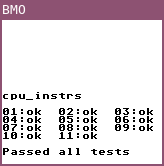

# bmo

A Game Boy emulator written in Go.

## Progress

- Cartridges (ROM only, MBC1)
- CPU (passes Blargg's CPU instruction test)



- Interrupt Controller
- PPU (background rendering, scrolling on the Y axis)

## Requirements

- SDL2 (`libsdl2-dev` on Debian-based distributions)

## Usage

- Copy the DMG bootrom to `roms/bootrom.gb`
- Compile and run the emulator:

```
$ go build
$ ./bmo -path <path to the ROM file>
```

## References

- [Gameboy CPU (LR35902) instruction set](http://www.pastraiser.com/cpu/gameboy/gameboy_opcodes.html)
- Game Boy Programming Manual
- [Pan Docs](http://gbdev.gg8.se/wiki/articles/Pan_Docs)
- [The Ultimate Game Boy Talk](https://www.youtube.com/watch?v=HyzD8pNlpwI)

## License

This project is licensed under the terms of the MIT license.
